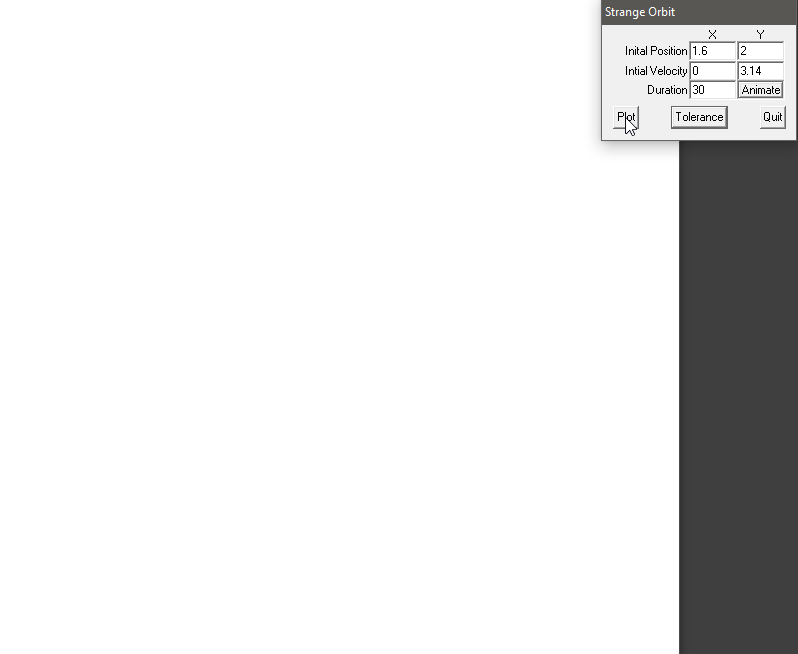
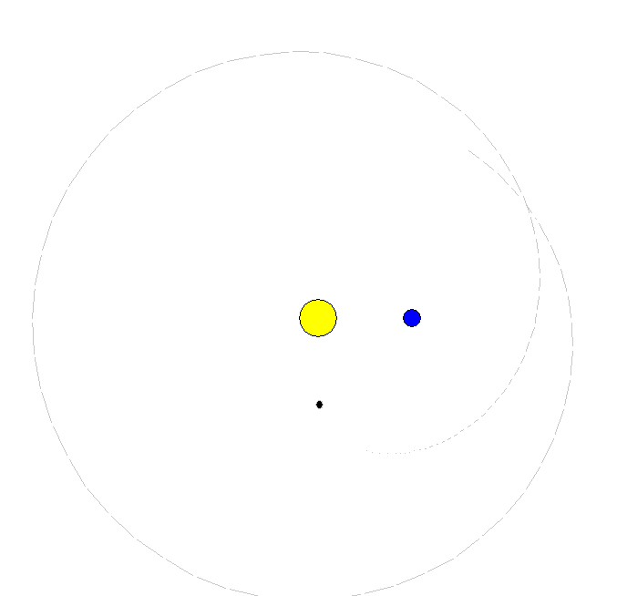

# Restricted-3-Body-Problem
This is a sophomore class project to solve the restricted three-body problem. Unfortunately the code is on a long forgotten floppy however the executable still works on Windows.

For a quick overview of the problem, Wikipedia has a good [explanation](https://en.wikipedia.org/wiki/Three-body_problem#Restricted_three-body_problem). Because it can be simplified down to a single 2D differential equation it becomes an exercise in numerical analysis. I believe [Runge-Kutta](https://en.wikipedia.org/wiki/Runge%E2%80%93Kutta_methods) was used to solve the initial value problem, and it would've ended there however I felt it needed a UI.

As you can see the interface is rather basic. Just set the initial position and velocity and tell it to plot the trajectory. The duration *may* be in years.

Of course once seeing how fast it plots, it was just a matter of slowing it down to animate the orbit.

A few initial values to try

| | X | Y | Vx | Vy |
|--|--|--|--|--|
| | 1.6 | 2 | 0 | 3.14 |
|4 lobe | 1.6 | 1.7889 | 0 | 3.14 |
